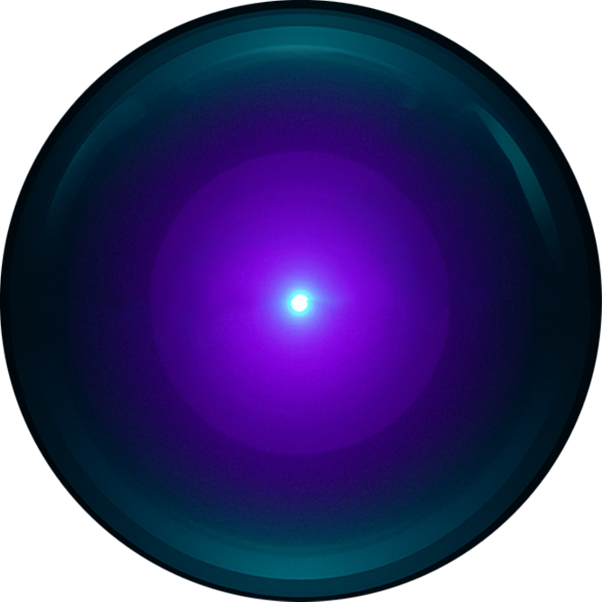

<div align="center">



# HAL Module Builder

**A browser-based, audio-reactive visual design tool.**

Build layered visuals — shapes, images, radial text, and audio equalizers —
and drive them in real time with live audio. Design in the editor, then flip
to a full-screen present mode. Its signature is the **radial graphics
system**: radial text, radial symmetry, and circular audio visualizations.


</div>

---

## Features

- **Layer-based editor** — compose visuals from shape, image, radial-text, and
  equalizer layers, each with transform, appearance, and effect controls.
- **Live audio reactivity** — map microphone / system audio to layer properties
  (scale, opacity, rotation, stroke width, brightness, hue shift, glow) with
  per-mapping intensity, attack/release smoothing, and beat detection.
- **Radial graphics** — radial text layout (arc mode, inner radius, orientation),
  an n-fold radial symmetry engine, and circular/radial audio visualizations.
- **Equalizer / visualizer** — bar, circle, dot, diamond, and hexagon
  visualizations with configurable color modes, frequency range, and symmetry.
- **Effects** — inner/outer glow and inner/outer shadow per layer.
- **Design / Present modes** — a full editor and a distraction-free
  full-screen presentation view.
- **Ships with the HAL eye** — the app opens with a curated, audio-reactive
  HAL-9000-style default design; use it as-is or tear it apart in the editor.

## Tech stack

React 18 · TypeScript · Vite · Canvas/Web Audio · Jest + Testing Library ·
Tailwind CSS

## Getting started

Requires **Node.js 18+**.

```bash
# install dependencies
npm install

# start the dev server (http://localhost:5173)
npm run dev

# production build
npm run build
npm run preview
```

Allow microphone access when prompted to drive the visuals with live audio.

## Scripts

| Command | Description |
| --- | --- |
| `npm run dev` | Start the Vite dev server |
| `npm run build` | Type-check and build for production |
| `npm test` | Run the Jest test suite |
| `npm run test:coverage` | Run tests with coverage |
| `npm run lint` | Lint `src` with ESLint |
| `npm run format` | Format `src` with Prettier |
| `npm run type-check` | Type-check without emitting |
| `npm run quality` | Type-check + lint + format check |

## Documentation

Technical docs live in [`docs/`](docs/) — see
[`docs/architecture/system-architecture-overview.md`](docs/architecture/system-architecture-overview.md)
for the high-level design.

## Contributing

See [CONTRIBUTING.md](CONTRIBUTING.md).

## License

[MIT](LICENSE)
