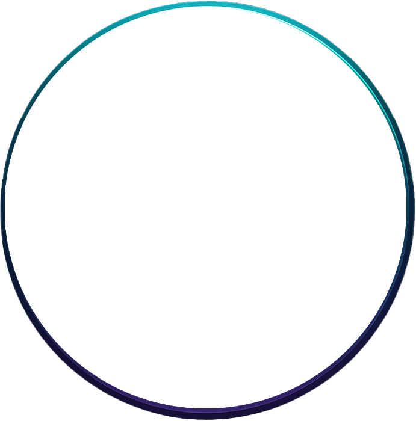

# HAL Builder

> Winamp visualizers for AI - transforming boring text into beautiful visual experiences



## What is HAL Builder?

HAL Builder is a visual interface system that transforms any AI interaction from static text exchanges into dynamic, beautiful visual experiences. Like Winamp visualizers made music visually captivating, HAL Builder makes AI conversations engaging to watch and experience.

Simply paste any LLM response and watch it come alive through equalizer bars, animated layers, and synchronized visual feedback. No API keys, no complicated setup - just pure visual enhancement for any AI system.

## Why HAL Builder?

### The Problem
AI interactions are visually boring. We stare at endless walls of text, missing the dynamic nature of AI processing. Current AI interfaces prioritize function over human visual pleasure.

### The Solution
HAL Builder adds a visual layer that makes AI interactions beautiful and engaging. It's not about utility - it's about transforming AI from a tool into an experience.

### The Vision
Every AI conversation should be as visually captivating as it is intellectually stimulating. HAL Builder bridges the gap between AI functionality and human aesthetic appreciation.

## How It Works

### Core Workflow
1. **Paste** - Copy any LLM response into HAL Builder
2. **Visualize** - Watch text transform into dynamic visual layers
3. **Customize** - Adjust animations, layers, and effects
4. **Save** - Store configurations as reusable templates

### Key Components

#### Layer Stacking System
- Unity-style component hierarchy with parent/child relationships
- Modular layers that can be mixed and matched
- Real-time preview with instant feedback

#### Animation Presets
- **Pop**: Explosive entrance effects
- **Fade**: Smooth opacity transitions
- **Jiggle**: Playful movement patterns
- **Depress**: Press-down interactions
- **Hover**: Responsive mouse effects

#### Visual Elements
- **Equalizer Bars**: Multi-layer audio visualizer aesthetic
- **Dynamic Layers**: Frame, lens, and iris components that scale and animate
- **Token Flow Display**: RPM gauge-style visualization showing AI processing
- **Nostalgic UI**: Winamp-inspired design with modern functionality

## Quick Start

### Prerequisites
- Node.js 18+ and npm
- Modern web browser with ES6 support

### Installation
```bash
git clone https://github.com/yourusername/hal-builder
cd hal-builder
npm install
```

### Development
```bash
# Start development server
npm run dev

# Build for production
npm run build

# Preview production build
npm run preview
```

### Basic Usage
1. Open HAL Builder in your browser
2. Click the central HAL button to activate
3. Paste any AI response into the text area
4. Watch the visual layers respond in real-time
5. Experiment with different animation presets
6. Save your favorite configurations as templates

## Key Features

*   **Advanced Layer-Based Compositing**: Create complex scenes by stacking and blending multiple layers, including images, shapes, and audio visualizations.
*   **Real-time Audio Visualization**: A powerful equalizer layer that reacts to microphone input.
*   **Text-to-Speech (TTS) Integration**: A new Audio Layer can generate speech from text using the Eleven Labs API. The first time you use it, you will be prompted to enter your API key, which is then stored locally.
*   **Extensible Architecture**: The system is designed for future expansion, with plans to incorporate Speech-to-Text (STT) and Speech-to-Speech (STS) functionalities.

## Getting Started

## Features

### Current Features ✓
- [x] Layer stacking system with parent/child relationships
- [x] Basic animation presets (pop, fade, jiggle)
- [x] Copy/paste LLM response integration
- [x] Real-time visual feedback
- [x] Template save/load system
- [x] Equalizer bar visualization
- [x] Nostalgic Winamp-inspired UI

### Coming Soon 🚧
- [ ] AI-generated dynamic layers
- [ ] Token flow visualization
- [ ] Conductor system for coordinated animations
- [ ] Advanced template marketplace
- [ ] Performance optimization for complex animations
- [ ] Cross-platform desktop applications

See the [ROADMAP.md](./ROADMAP.md) for detailed development timeline and [FEATURES.md](./FEATURES.md) for comprehensive feature descriptions.

## Technical Stack

- **Frontend**: React 18 + TypeScript
- **Styling**: Tailwind CSS with custom animation system
- **Build Tool**: Vite for fast development and optimized builds
- **Animation**: Custom CSS animation engine
- **Architecture**: Component-based modular design

## Documentation

- [**VISION.md**](./VISION.md) - Creative direction and project aspirations
- [**TECHNICAL_SPEC.md**](./TECHNICAL_SPEC.md) - Architecture and implementation details  
- [**ROADMAP.md**](./ROADMAP.md) - Development phases and milestones
- [**FEATURES.md**](./FEATURES.md) - Comprehensive feature descriptions
- [**Project Brief**](./project-brief.md) - Original project overview
- [**Brainstorming Results**](./brainstorming-session-results.md) - Ideation session outcomes

## Contributing

HAL Builder is currently a portfolio/showcase project developed solo. While not accepting contributions at this time, feedback and suggestions are welcome through issues.

## License

This project is developed for portfolio and career advancement purposes. Please contact for usage rights and licensing information.

## Inspiration

HAL Builder draws inspiration from:
- **Winamp Visualizers**: The nostalgic beauty of audio visualization
- **Unity Editor**: Hierarchical component systems
- **Modern AI Tools**: The gap between functionality and visual appeal
- **Retro Computing**: When software prioritized user delight

---

**Remember**: HAL Builder isn't about making AI more functional - it's about making AI interactions beautiful and engaging for humans. Like Winamp visualizers, it transforms the utilitarian into the captivating.